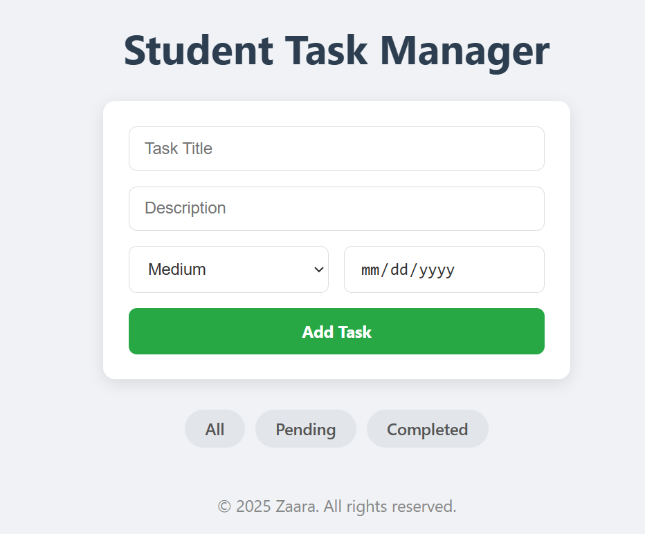
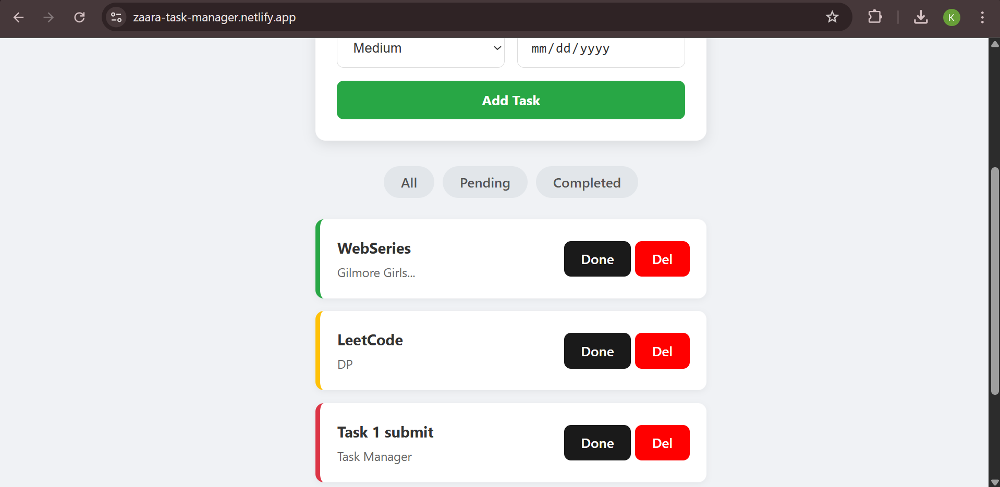
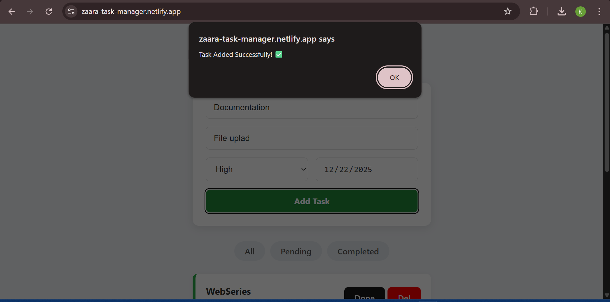

# Student Task Manager 📝

A full-stack web application to manage student tasks efficiently. Built with React.js, Node.js, Express, and MongoDB.

## 🚀 Live Demo
- **Frontend:** https://zaara-task-manager.netlify.app/
- **Backend:**  https://finaltaskmanager.onrender.com

## 🛠️ Tech Stack
- **Frontend:** React (Vite), CSS
- **Backend:** Node.js, Express.js
- **Database:** MongoDB Atlas
- **Deployment:** Netlify & Render

## ✨ Features
- Add, Edit, and Delete Tasks
- Mark tasks as Completed
- Filter by Status (All/Pending/Completed)
- Responsive Design

## 📸 Screenshots

### 1. Home Page & Task List

### 2. Add Task Form

### 3. Success Message

---
&copy; 2025 Zaara. All rights reserved.