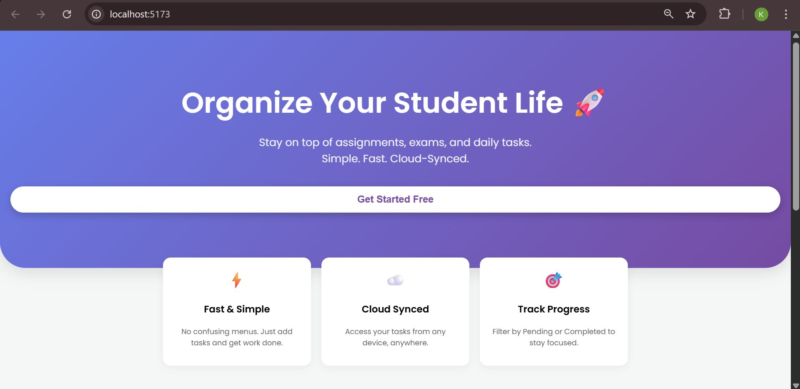
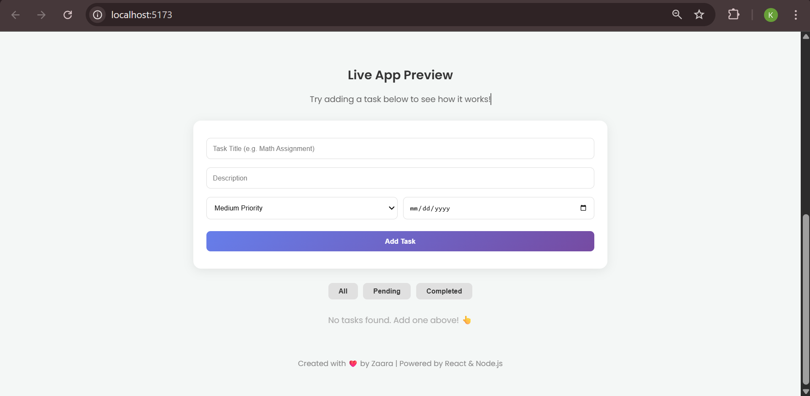

# Student Task Manager - Landing Page Edition 🚀

A responsive **Landing Page** designed for a Student Task Management application. This project satisfies the assignment requirement for a Landing Page while integrating a fully functional Full-Stack application.

## 🔗 Live Demo
- **Landing Page:** (https://zaara-student-manager-landing.netlify.app/)
- **Backend API:** https://finaltaskmanager.onrender.com

## 🛠️ Tech Stack
- **Frontend:** React.js (Vite), CSS3 (Animations)
- **Backend:** Node.js, Express.js
- **Database:** MongoDB Atlas
- **Deployment:** Netlify & Render

## ✨ Key Features (Assignment Highlights)
- **🎨 Modern Landing Page:** Designed with a gradient Hero section and "Feature" cards.
- **✨ Smooth Animations:** CSS Keyframes used for slide-in entrance effects.
- **📅 Smart Validation:** Date picker restricts selecting past dates for tasks.
- **📱 Responsive Design:** Fully optimized for Mobile and Desktop views.
- **🔄 Full Functionality:** Integrated with a live backend to Create, Read, Update, and Delete tasks.

## 📸 Screenshots

### 1. Landing Page (Hero Section)

### 2. Task Management App

---
&copy; 2025 Zaara. All rights reserved.